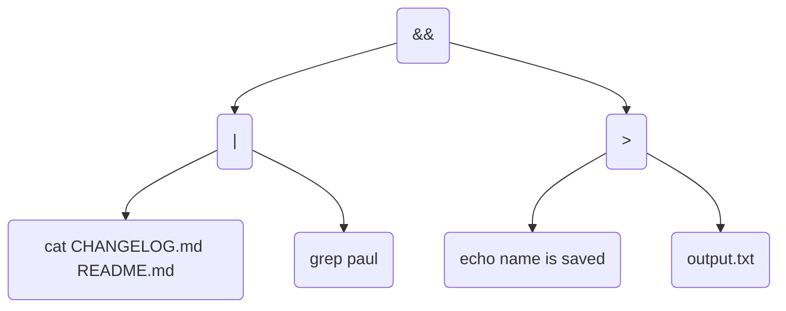
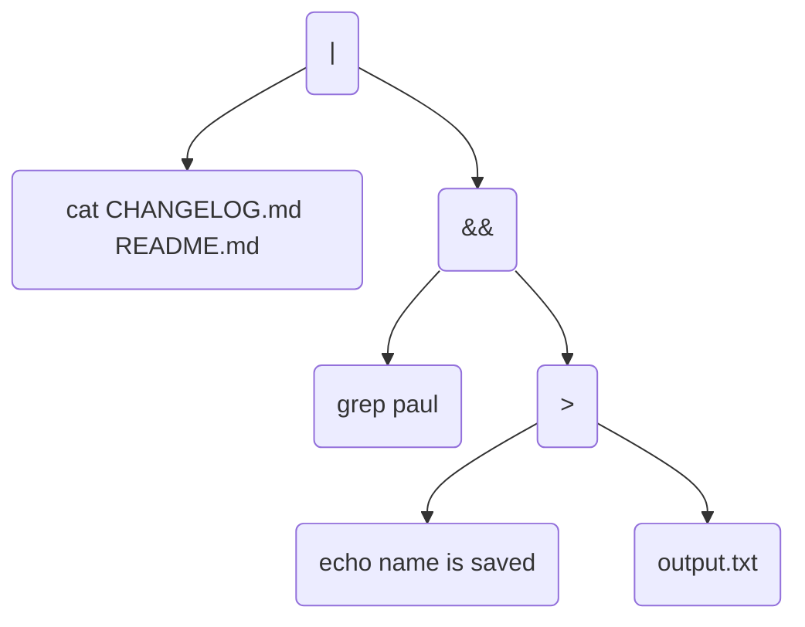

# minishell by nburchha & fschuber


"`Completely reliable & advanced shell`"\
A mini BASH - recreation. Made by [`Frederick Schubert`](https://github.com/FreddyMSchubert) & [`Niklas Burchhardt`](https://github.com/nburchha).


# Installation

Open up a terminal.

Clone the repository:
```bash
git clone https://github.com/FreddyMSchubert/42_minishell.git crash
cd crash
```
Compile the project:
```bash
make comp
```
Run the minishell:
```bash
./crash
```
If you want to exit:
```bash
exit
```


# Project introduction
> The existence of shells is linked to the very existence of IT.\
> At the time, all developers agreed that communicating with a computer using aligned 1/0 switches was *seriously irritating*.\
> It was only logical that they came up with the idea of creating a software to communicate with a computer using interactive lines of commands in a language somewhat close to the human language.\
> Thanks to **Minishell**, you’ll be able to travel through time and come back to problems people faced when *Windows* didn’t exist.


# The Task
This is the biggest 42 project we've completed so far, and also the first large project as a team. The following features were to be implemented:

Our shell should
- Display a `prompt` when waiting for a new command.
- Have a working `history`.
- Search and launch the right executable (based on the `PATH` variable or using a relative or an absolute path).
- Avoid using more the `one global variable` to indicate the received signal. Consider the implications: this approach ensures that your signal handler will not access your main data structures.
- Not interpret unclosed quotes or special characters which are not required by the subject such as \ (backslash) or ; (semicolon).
- Handle ' (single quote) which should prevent the shell from interpreting the meta-characters in the quoted sequence.
- Handle " (double quote) which should prevent the shell from interpreting the meta-characters in the quoted sequence except for $ (dollar sign).
- Implement `redirections`:
    - `<` should redirect input.
    - `>` should redirect output.
    - `<<` should be given a delimiter, then read the input until a line containing the delimiter is seen. However, it doesn't have to update the history! (heredoc)
    - `>>` should redirect output in append mode.
- Implement `pipes` (| character). The output of each command in the pipeline is connected to the input of the next command via a pipe.
- Handle `environment variables` ($ followed by a sequence of characters) which should expand to their values.
- Handle `$?` which should expand to the exit status of the most recently executed foreground pipeline.
- Handle ctr-C, ctrl-D, ctrl-\ which should behave like in `bash`.
- In interactive mode:
    - ctrl-C displays a new prompt on a new line.
    - ctrl-D exits the shell.
    - ctrl-\ does nothing.
- Your shell must implement the following `builtins`:
    - `echo` with option -n
    - `cd` with only a relative or absolute path
    - `pwd` with no options
    - `export` with no options
    - `unset` with no options
    - `env` with no options or arguments
    - `exit` with no options

The readline() function can cause memory leaks. You don't have to fix them.

If you have any doubt about a requirement, take `bash` as a reference.

> Especially that last line about bash was about to cost us many hours.

## The Bonus

If you choose to do the bonus (we did), your program also has to implement:
- `&&` and `||` with `parenthesis ()` for priorities.
- Wildcards `*` should work for the current working directory.


# The Approach / Implementation

Very similar to how bash handles its process, our program structure looks something like this:

`expander` -> `lexer` -> `validator` -> `parser` -> `executor`

## Expander

Starting out, we only have the input string. This may look something like this: `cat *.md | grep $USER`. Before doing anything else, we need to change the actual content of the string in a couple ways.

1. env expansions -> A $ followed by an environment variable key will transform into the environment variables value. => `cat *.md | grep paul`
2. wildcard expansions -> Within the current working directory, you can select files more dynamically than just manually listing them by adding a * which stands for any amount of any sequence of any characters. In our example, assuming we are currently in this repos main directory, *.md would reference the files CHANGELOG.md and README.md. => `cat CHANGELOG.md README.md | grep paul`

In the Expander, quotes are considered. For example, '$USER' would return out of the Expander as $USER, while "$USER" would expand to paul. Here, we also have to handle abominations such as `echo "'""'$USER'""'"`. This example would output `''paul''`.

## Lexer

Executing everything from a string sounds like a terrible idea. Instead, the lexer will identify the type of argument each part of the string is. In total, we differentiate between 10 different arguments in our shell:

- TOK_WORD          -> Commands or Arguments
- TOK_S_QUOTE       -> Single Quotes (`'`)
- TOK_D_QUOTE       -> Double Quotes (`"`)
- TOK_BUILTIN       -> A builtin (`echo`, `cd`, `pwd`, `export`, `unset`, `env` or `exit`)
- TOK_REDIR         -> A redirection (`<`, `>`, `>>` or `<<`)
- TOK_PIPE          -> A pipe (`|`)
- TOK_LOG_OR        -> A logical OR operator (`||`)
- TOK_LOG_AND       -> A logical AND operator (`&&`)
- TOK_OPEN_BRACE    -> An opening brace (`(`)
- TOK_CLOSE_BRACE   -> A closing brace (`)`)

Now, lets expand our example input String a bit to show off the Lexer a little bit better:

`(cat CHANGELOG.md README.md | grep paul) && echo name is saved > output.txt`

This String would be saved like this after the Lexer:

`(` -> TOK_OPEN_BRACE \
`cat` -> TOK_WORD \
`CHANGELOG.md` -> TOK_WORD \
`README.md` -> TOK_WORD \
`|` -> TOK_PIPE \
`grep` -> TOK_WORD \
`paul` -> TOK_WORD \
`)` -> TOK_CLOSE_BRACE \
`&&` -> TOK_LOG_AND \
`echo` -> TOK_WORD \
`name` -> TOK_WORD \
`is` -> TOK_WORD \
`saved` -> TOK_WORD \
`>` -> TOK_REDIR \
`output.txt` -> TOK_WORD

The lexer also considers
- potentially missing spaces in the input String. For example `(cat *.md|grep $USER)&&echo name is saved>output.txt` would work the same way.
- parenthesis -> `echo "hi && echo ho"` would print `hi && echo ho`, no `hi ho`

## Validator

So far, we've only looked at valid commands. But of course, inputting `)" && < echo '" && || >(` shouldn't make our program light up in a firestorm of segfaults. \
The Validator checks the validity of a given command. If it's invalid, an appropriate error is outputted.

## Parser

Before executing, we need to figure out what order to execute our inputs in. For this, we'll need to create an abstract syntax tree / binary tree. For our command, it would look as follows:



Our program steps through the commands, creating two branches at the most dominant operator. The most dominant operator is always the leftmost one, and the operators themselves are sorted in the following order:

`TOK_LOG_AND` > `TOK_LOG_OR` > `TOK_PIPE` > `TOK_REDIR`

This is also where parenthesis become important for the last time, because the parser actually removes them as part of his functionality, also incorporating them into the priority calculation. Without parenthesis, the image up above would instead look like this:



This is, of course, a considerable difference in logic.

## Executor

Finally, execution!

This is, of course, where the magic happens - redirections get piped, file descriptors get shuffled around and return codes get retrieved and checked.

Lets just check what our command outputted:

`paul`

This was outputted by the grep command - but what happened to output of the second echo call? It is now written into a file called out in the directory the command was executed.

`name is saved` written into out file.

### Builtins
| Builtin | Description                                               | Usage Example                  |
|---------|-----------------------------------------------------------|--------------------------------|
| `echo`  | Print text to the console. Use `-n` to not print newline. | `echo -n "Hello, World!"`      |
| `cd`    | Change the current directory. Supports ~, which will be replaced with your HOME directory, and -, which will return you to where you just were previously.                             | `cd /path/to/directory`        |
| `pwd`   | Print the path to the current working directory.                      | `pwd`                          |
| `export`| Set or export environment variables.                      | `export PATH=/bin GREETING=hiya`      |
| `unset` | Remove environment variables.                             | `unset PATH GREETING`                   |
| `env`   | List all environment variables.                           | `env`                          |
| `exit`  | Exit the shell with the exit code given as an argument or 0.                                           | `exit`                         |

### Redirections
There are 4 types of redirections.
1. Standard input redirection `<`
	- e.g. `sort < todos.txt`
	- Redirects the contents of `todos.txt` to serve as input for sort
2. Standard output redirection `>`
	- e.g. `./run_minishell_tests > out.txt`
	- Writes the output of ./run_minishell_tests into out.txt - this may well be the most useful redirection for everyday tasks.
3. Standard output append redirection `>>`
	- e.g. `valgrind ./run_minishell_tests > out.txt`
	- Appends the output of valgrind ./run_minishell_tests to out.txt without overwriting its previous contents
4. Here Document (Heredoc)
	- e.g. `cat << STOP`

To make this work, every node (each box in the parser diagram) saves an input and an output file descriptor. To redirct a file into a command, the program would open a file descriptor and set it as that commands input. We then initialize it as the commands input before executing the command.

### Heredoc
Heredoc (Here Document) allows you to enter a special mode in our shell that allows you to simulate a file in your command if you only need it once.
For example, `cat << STOP` will allow you to enter lines until you begin a line with STOP. Then, the command will continue as if it was referencing a file - in this case, cat would print out whatever you previously typed.
```bash
command << DELIMITER
heredoc> line 1
heredoc> line 2
heredoc> line 3
DELIMITER
line 1
line 2
line 3
```

### Pipes
Pipes are used to literally change the output file descriptor from the usual STDOUT_FILENO (1) and the input file descriptor from the usual STDIN_FILENO (0) of different commands to literally write into each other.
`ls -la | wc -l`
```
ls -la -> INPUT: 0, OUTPUT 3;
PIPE -> INPUT: 3, OUTPUT: 4;
wc -l -> INPUT: 4, OUTPUT: 1;
```
This is a super useful feature and can be used in a huge variety of ways. For example:
`cat file.txt | grep 'tomato' | sort`
1. `cat file.txt` -> This command outputs the contents of file.txt
2. `grep 'tomato'` -> This command only outputs the lines of its input that contain the character sequence "tomato".
3. `sort` -> This command takes its input and sorts the lines alphabetically.

In our implementation of pipes, we ensure that all these transformations happen efficiently and reliably, allowing you to chain as many commands as needed to achieve complex data processing tasks.

`cat bigfile.txt | tr ' ' '\n' | sort | uniq -c | sort -nr | head -10`

### Signals

Usually, when pressing ctrl+C to send a SIGINT signal to a process, this process closes. But since bash instead decides to just close the currently running process inside of the shell, we shall do the same. There are three types of signals we handled in different ways:

1. SIGINT (ctrl+c) -> Instead of quitting our shell, this will clear whatever process is happening right now and display a new line with a fresh prompt awaiting input.
2. SIGQUIT (ctrl+\\) -> This is usually used to quit the proces & do a core dump - but in our shell, it simply doesn't have any effect.
3. EOF (ctrl-d) -> EOF or end of file signals the end of input - sending it will make our program close smoothly.

### 'Garbage Collector'
This is worth a note (as it may be a little confusing) - instead of enduring the headache of constantly tracking every single allocated thing at every point in the program, which we tried and it was not very fun as the program was pretty expansive, we made a simple list that keeps track of all dynamically allocated resources, freeing them whenever a command ends. The performance impact of this is minimal, but it greatly reduces the codes complexity.

I really liked this idea and will reuse it - next time, I may even make my own malloc function that immediately appends my resources to the garbage collector & does the malloc protection, making things a lot more simple.


# Fun stuff to try

general
- `echo "WeLcOmE tO cRaSh" | tr 'a-z' 'A-Z'`
- `grep -R "//" src`
- `echo "The Answer to the Great Question, of Life, the Universe and Everything is..." && echo "Rk9VUlRZVFdPCg==" | base64 --decode`
- `cat assets/testfile.txt | grep "Deep Thought" | tr 'a-z' 'A-Z'`

let's break stuff
- `unset $PATH` - this environment variable is used to find executables when you only type in e.g. `ls` - unsetting it may cause some mayhem. You will, however, still be able to use system executables by directly typing in their path `/bin/ls`.
- `cat /dev/urandom` will welcome you to the outside of the matrix (if you want to see things burn, may or may not crash your terminal and/or pc.)
- `< file cat >> file` will make an endless file with the contents of file (if you really want to see things burn). You have create & put something into the file first though.
